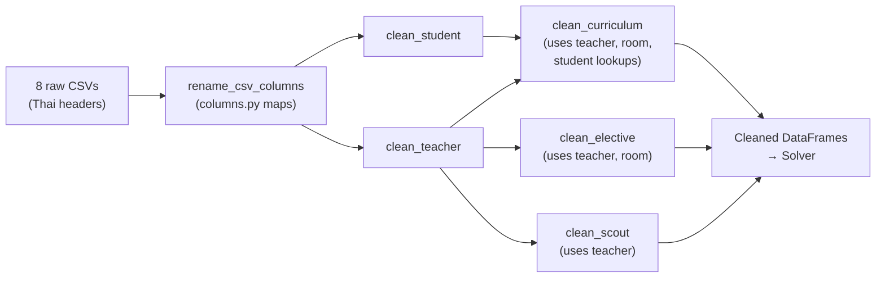

# ScheDool — `solver_something/` Data-Cleaning Pipeline

> **Purpose**: Ingests raw Thai-language CSV files exported from a school scheduling spreadsheet,
> renames columns to English, resolves human-readable names to internal IDs, and outputs
> clean DataFrames ready for the scheduling solver.

---

## Architecture Overview

```
Raw CSV files (Thai headers)
        │
        ▼
  data_cleaning.py          ← orchestrator / entry-point
   ├── columns.py           ← Thai → English column rename maps
   ├── mapping.py           ← lookup builders & ID resolvers
   ├── csv_cleaner.py       ← per-sheet cleaning functions
   └── chunks_processor.py  ← (DISABLED) prompt chunker for LLM agent
```

---

## File-by-File Breakdown

### 1. `columns.py` — Column Rename Maps

Defines **7 dictionaries** mapping Thai column headers → English names for each CSV:

| Dict name | Target sheet | Key columns (English) |
|---|---|---|
| `curriculum_column` | curriculum | `subject_id`, `subject_name`, `periods_per_week`, `teacher`, `block_pattern`, `student_class`, `constraint`, `room`, `fixed_period` |
| `elective_static_column` | elective | `subject_id`, `subject_name`, `teacher`, `room` |
| `teacher_column` | teacher | `teacher_id`, `teacher_name`, `available_slots`, `unavailable_slots`, `constraint` |
| `period_column` | period | `period_label`, `period_time` |
| `prepalce_column` | preplace | `slot_name`, `periods`, `apply_to` |
| `room_column` | room | `room_id`, `note`, `tag` |
| `student_column` | student | `class_id`, `grade`, `section`, `default_room`, `curriculum` |

All maps are consolidated into `csv_column_mapping` dict keyed by sheet name.

---

### 2. `mapping.py` — Lookup Builders & ID Resolvers

Provides helper functions that convert human-readable values into internal IDs.

| Function | Input → Output | Notes |
|---|---|---|
| `create_room_lookup(df_room)` | Builds `Dict[str, List[str]]` mapping room tags/notes/IDs → list of room IDs | Allows lookup by tag (e.g. `"COM"`) or direct ID |
| `create_teacher_lookup(df_teacher)` | `teacher_name → teacher_id` dict | Simple index swap |
| `get_elective_dynamic_mapping(input_data)` | Uses `preplace` sheet to map Thai slot names → period strings (e.g. `"FRI_2-FRI_3"`) | Used during column rename of elective sheet |
| `resolve_teacher_names_to_ids(raw, lookup)` | Comma-separated teacher names → single ID / list of IDs / `None` | Warns on unmapped names |
| `resolve_room_to_ids(raw, lookup)` | Comma-separated room tags/IDs → single ID / sorted list / `None` | Warns on unresolved requirements |
| `get_grade_sections(df_student)` | `Dict["ม.X", List[int]]` — for each grade, which sections exist | Used by curriculum cleaner to expand "all sections" |
| `parse_student_class_string(section_str)` | `"/1, /3-5"` → `[1, 3, 4, 5]` | Supports specific, range, and mixed formats |

Also defines `expected_file` — the 8 CSV filenames the pipeline expects:
`curriculum`, `elective`, `teacher`, `period`, `preplace`, `room`, `student`, `scout`.

---

### 3. `csv_cleaner.py` — Per-Sheet Cleaning Functions

Each function takes a raw (already-renamed) DataFrame and returns a cleaned copy.

| Function | What it does |
|---|---|
| `clean_curriculum(df, df_teacher, df_room, df_student)` | **Heaviest cleaner.** Iterates row-by-row. Detects grade markers (`ม.X`), fills forward `subject_id`/`subject_name`, resolves teacher names → IDs, expands `student_class` to full `grade/section` IDs, resolves room tags → IDs, defaults `block_pattern` from `periods_per_week`. |
| `clean_elective(df, df_teacher, df_room)` | Resolves teacher and room columns via `apply()`. Strips subject ID/name. |
| `clean_scout(df, df_teacher)` | Resolves **every** column's values as teacher names → IDs. |
| `clean_teacher(df)` | Removes marker rows (`ครูในโรงเรียน`, `อาจารย์นอก`) and NaN teacher IDs. |
| `clean_student(df)` | Ensures `grade` is string, `section` is numeric int. |

---

### 4. `data_cleaning.py` — Orchestrator / Entry-Point

Two functions:

1. **`rename_csv_columns(input_data, mapping)`** — Iterates all sheets, applies static column rename, and for the `elective` sheet also applies dynamic slot-column rename via `get_elective_dynamic_mapping`. Drops unmapped columns.

2. **`clean_input_data(input_data)`** — **Main entry-point.** Calls `rename_csv_columns` first, then runs the per-sheet cleaners in dependency order:
   ```
   student → teacher → curriculum → elective → scout
   ```
   Returns the fully processed `Dict[str, pd.DataFrame]`.

---

### 5. `chunks_processor.py` — LLM Prompt Chunker *(entirely commented out)*

Was designed to:
- Chunk large DataFrames into ≤75-row segments
- Format each chunk as Markdown
- Wrap data between a `system_prompt.txt` (Part 1) and an `operation_prompt.txt` (final Part)
- Return a list of prompt strings to feed sequentially to an LLM agent

**Status**: 100 % commented out — not currently in use.

---

## Data Flow Summary


